# Description

Ce plugin permet d'établir une connexion entre Facebook Messenger et Jeedom pour
envoyer des alertes à partir de Jeedom ou discuter avec Jeedom (en utilisant les
 interactions).

# 1. Pré-requis

Les pré-requis suivant sont nécessaires pour faire fonctionner le plugin fbbot :
-   Disposer d'une URL externe pour Jeedom
-   Être en https (imposé par Facebook)
-   Avoir configuré des interactions dans Jeedom pour que Jeedom comprenne des
commandes
-   Disposer d'un compte Facebook
-   Disposer d'un compte Facebook Developper (simple et gratuit)
-   Avoir téléchargé le plugin (qui a dit que c'était évident ? ;)

# 2. Etapes d'installation

Dans l'ordre nous allons effectuer les étapes d'installation suivantes :
-   Créer l'application Messenger sur Facebook
-   Ajouter l'équipement logique dans Jeedom
-   Configurer le webhook sur Facebook
-   Créer et gérer les utlisateurs

Ces étapes doivent être effectuées dans cet ordre afin de disposer des tokens
nécessaires pour autoriser l'interaction entre Facebook et votre Jeedom.

3. Création de l'application Messenger
===

La première étape est de créer une page Facebook (à ne pas confondre avec un
compte ou un profil utilisateur).
Pour créer une page Facebook aller sur <https://www.facebook.com/pages/create>

La création d'une page Facebook est imposée par Facebook pour tous les bots
Messenger. Cette page, publique, servira de profil publique à votre bot.
Son nom et son avatar seront notamment
ceux qui s'afficheront dans Facebook Messenger, alors choisissez-bien.

Faites également attention de ne pas y mettre de données personnelles sensibles
 telle que votre adresse ou votre numéro de téléphone.

Nous allons maintenant créer une application Facebook Messenger.

Pour créer une application Messenger aller sur
<https://developers.facebook.com/apps>.
Cliquer sur "Add a new app". Choisir un nom et confirmer un email de contact,
puis valider.
Sur la page qui s'affiche, cliquer sur le bouton "Get Started" de la ligne
Messenger.

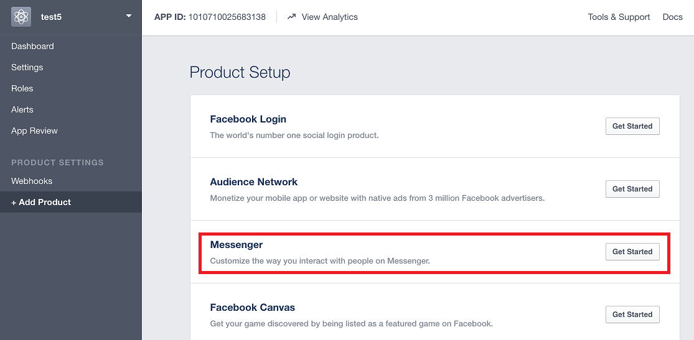

Maintenant, descendez au niveau du paragraphe "Token Generation".
Dans le champ Page, choisir la page créée en début d'étape 2 pour contenir les
informations de votre bot.

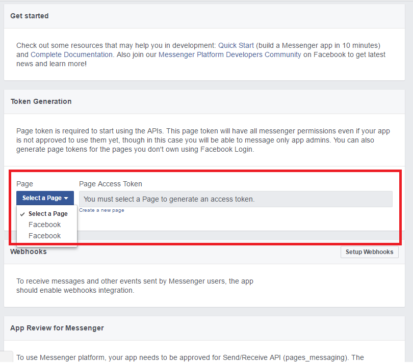

Cela vous génère un token dans le champ "Page Access Token" permettant d'accéder
et d'utiliser les API Facebook. Copier ce token afin de le réutiliser dans
quelques secondes.
Nous allons maintenant passer à l'étape de création dans Jeedom.

# 4. Configuration des équipements

Nous allons maintenant créer un équipement dans Jeedom pour gérer notre bot.
Allez dans Jeedom et choisissez "Fbbot" dans la liste des plugins.

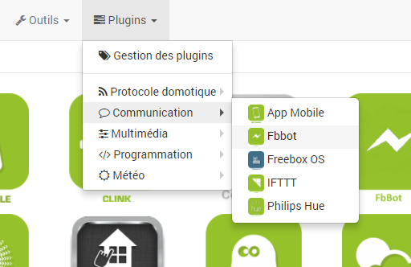

Cliquer sur (+) pour ajouter un nouvel équipement.

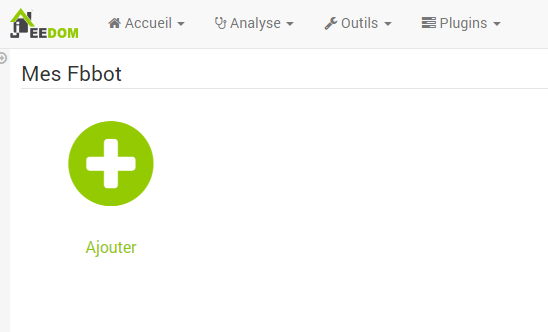

Donner lui le nom de votre choix.

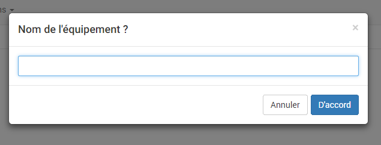

Une fois que vous cliquez sur Valider, vous obtiendrez la page de configuration
suivante :

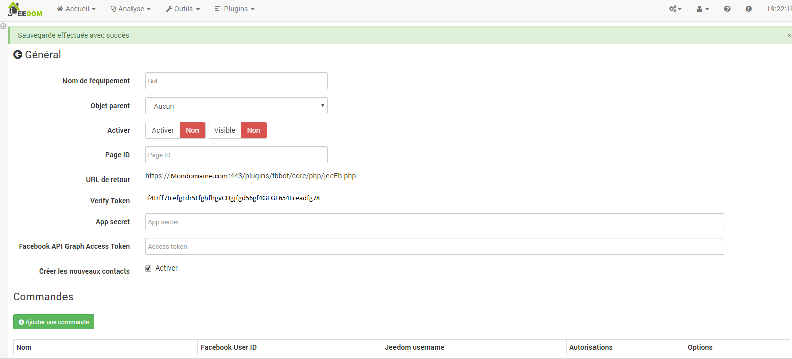

Vous retrouvez ici toute la configuration de votre équipement.
Vous devez absolument renseigner l'ensemble des champs suivants pour pouvoir
faire fonctionner votre équipement :
-   **Nom de l&#8217;équipement** : nom de votre équipement Fbbot
-   **Activer** : permet de rendre votre équipement actif
-   **Visible** : le rend visible sur le dashboard
-   **Page ID** : c'est l'ID de votre page Facebook que vous avez crée un peu
plus haut. Cette donnée est obligatoire. Elle est utilisée comme identifiant
logique dans Jeedom et servira à distinguer vos différets bots si vous en
créez plusieurs. Pour trouver cet identifiant suivez les étapes du paragraphe
ci-après.
-   **URL de retour** : c'est l'url de votre Webhook qu'il faudra
renseigner dans Facebook à l'étape suivante. Cette URL doit être en https et
impérativement accessible de l'extérieur.
-   **Verify Token** : token de l'api fbbot dans Jeedom. Ce token est
 utilisé par Facebook lors de la vérification de votre webhook.
-   **App secret** : il s'agit du code de sécurité de votre application sur
Facebook. Ce code sert à crypter un token de vérification permettant à chaque
utilisation par Facebook de votre webhook de vérifier que les données reçues
ont bien été envoyées par Facebook et non pas par une tierce partie. Ce code
est obligatoire. Voir le paragraphe ci-après pour savoir ou trouver ce code.
-   **Facebook API Graph Access Token** : il s'agit du token généré par Facebook
pour vous permettre d'utiliser leur API. Ce token est celui que nous avons
copié dans l'étape précédente. Collez le ici.
-   **Créer les nouveaux contacts** : il s'agit d'une option indiquant à Jeedom
de créer automatiquement les nouveaux contacts. Voir détail dans le paragraphe
de gestion des utilisateurs.

En dessous vous retrouvez la configuration des commandes :

-   **Nom** : nom de la commande
-   **Facebook User ID** : ID de l'utilisateur Facebook sous forme numérique
-   **Jeedom Username** : nom de l'utilisateur Jeedom associé à l'utilisateur
 Facebook
-   **Autorisations** : Cette colonne contient par défaut le seul champ
 "Visible", puis contiendra pour les utilisateurs ajoutés les champs Chat
 et Notifications qui sont expliqués dans la rubrique gestion des utilisateurs.
-   **Tester** : permet de tester la commande
-   **Supprimer (signe -)** : permet de supprimer la commande

Par défaut les commandes contiennent trois commandes crées lors de
 l'installation ou lors de modification de la configuration du plugin :
-   **Expéditeur** : Commande info contenant l'identifiant numérique Facebook
 du dernier utilisateur à avoir utilisé le webhook, c'est à dire à avoir envoyé
  une commande via Facebook Messenger.
-   **Message** : Commande info contenant le texte du dernier message reçu via
 Facebook Messenger.
-   **Tous** : Permet de contacter tous les utilisateurs enregistrés lorsqu'il
 y en aura. Voir gestion des utilisateurs.

## 4.1 Trouver l'identifiant de sa page Facebook

Pour trouver l'identifiant de sa page Facebook, suivez les étapes suivantes :

Aller sur la page Facebook que vous avez crée en début de process.

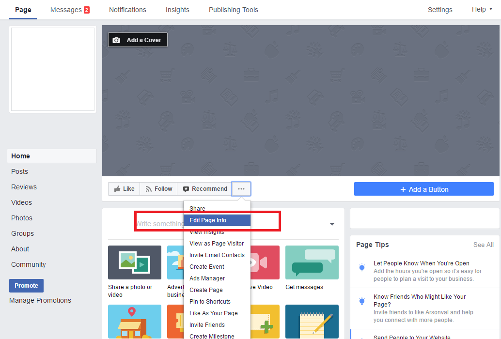

Cliquer sur Edit Page Info. Cela ouvre le pop-up suivant :

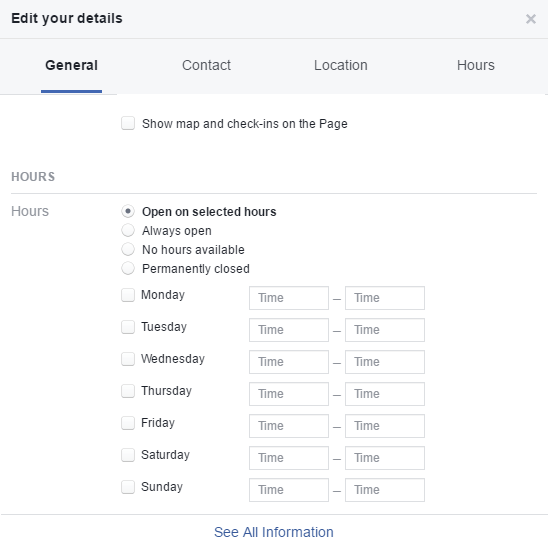

Scroller tout en bas, puis cliquer sur "See All Information". Cela ouvre la
 page suivante :

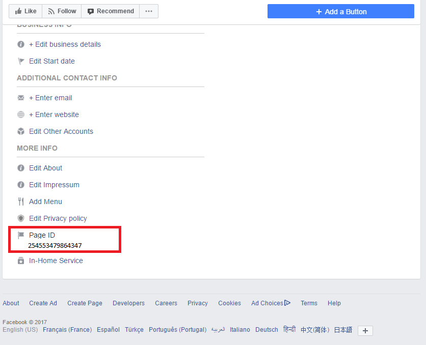

Votre Page ID est tout en bas. Copier le dans le champ "Page ID" de votre
 équipement fbbot.

## 4.2 Trouver l'app secret

Pour trouver votre app secret suivre les étapes suivantes :

Aller sur la page d'accueil Developers Facebook à l'adresse suivante : <https://developers.facebook.com/apps/>.

Cliquer sur le nom de l'application que vous venez de créer dans les étapes
 précédentes.

Sur la page qui s'affiche cliquer sur le bouton "Show" pour visualiser l'app
 secret.

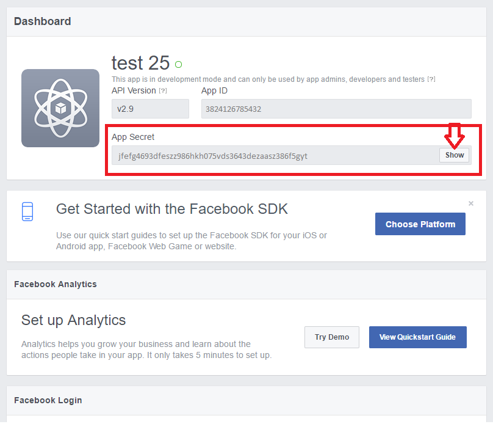

Copier ce code dans le champ "App Secret" des paramètres de votre équipement
 fbbot Jeedom.

# 5. Configuration du webhook

A ce stade notre équipement fbbot a été complètement configuré et activé et est
 donc pleinement fonctionnel.
Il faut désormais ajouter la configuration du webhook à notre application
 Facebook Messenger.
Ce webhook permettra à Facebook de savoir comment et ou contacter notre Jeedom
 lorsqu'un nouveau message est reçu sur Facebook Messenger.
Pour cela rendez-vous sur la page de configuration de votre application
 Facebook Messenger.

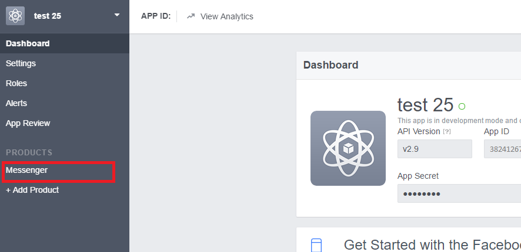    

Si vous aviez quitté la page de configuration de l'étape 3, cliquer sur le lien
 Messenger dans votre Dashboard, comme montré ci-dessus.

Descendez jusqu'au paragraphe Webhooks et cliquer sur le bouton "Setup
 Webhooks".

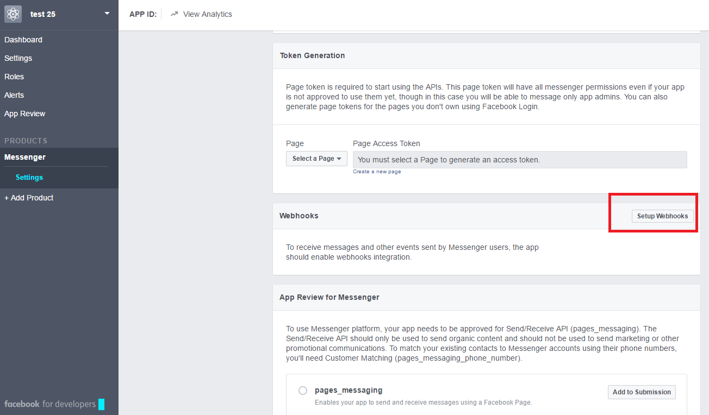

Vous arrivez sur la page "New Page Subscription".
Dans le champ "Subscription Fields", cochez les cases suivantes :
* messages
* messaging_postbacks
* message_reads

Dans le champ "Callback URL", entrer votre URL de retour indiqué dans le champ
 "URL de retour" de la page de configuration de votre équipement.

Dans le champ "Verify Token", entrer votre Verify Token indiqué dans le champ
 "Verify Token" de la page de configuration de votre équipement.

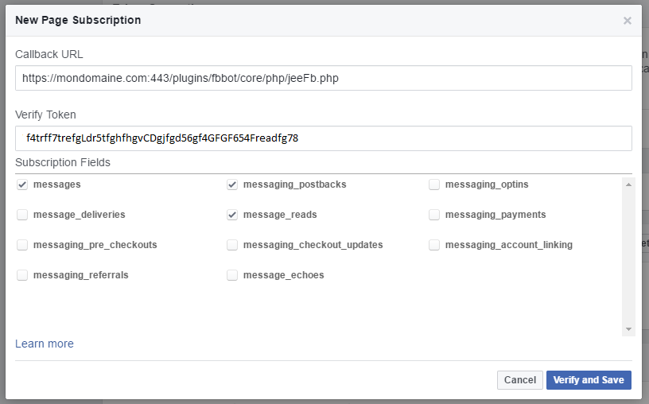

Cliquez sur "Verify and Save".

Un indicateur vert vous confirmera que l'opération de vérification a réussi et
 le bon enregistrement.

Si cette étape échoue c'est que vous avez manqué ou mal effectué l'une des
 opérations précédentes. Revenir en début de guide et recommencer.

Votre Jeedom et Facebook Messenger peuvent maintenant communiquer.

# 6. Gestion des utilisateurs

Vous venez de finir la configuration du plugin et de Jeedom.
Il vous faut à présent utiliser le bot.
Allez sur votre page Facebook et entamer une discussion ou bien trouver votre bot sur Messenger et entamer une discussion.

Attention, par défaut la visbilité de votre bot est limité à l'administrateur de l'application Facebook crée. Pour y ajouter des utilisateur sans avoir à publier votre bot et donc à le faire vérifier par les équipes Facebook, vous devrez ajouter des utilisateurs en tant que Tester.

Pour trouver votre bot utilisez donc bien le compte de l'adminsitrateur qui l'a
crée.

Lorsque vous entamerez la discussion la réponse sera un implacable "Utilisateur non habilité".
En effet pour pouvoir utiliser le bot, chaque utilisateur devra être autorisé.
La gestion des autorisations se fait au niveau des commandes de l'équipement.

			

Les différentes options et commandes à utiliser sont les suivantes :
* **Créer les nouveaux contacts** : Par défaut tous les utilisateurs qui contactent votre bot seront ajoutés dans la liste des commandes. Cela vous évite de devoir trouver les ID Facebook des utilisateurs que vous souhaitez ajouter. Pour désactiver cette option, décochez la case.
* **Chat** : Une fois l'utilisateur crée, pour l'autoriser, il vous faudra cocher la case "Chat". Cette case autorise les interactions depuis Facebook Messenger.</li>
* **Notifications** : La case notifications permet de choisir les utilisateurs qui recevront les messages lorsque la commande "Tous" sera utilisée pour envoyer une alerte. Cochez la case pour inclure l'utilisateur ou décochez là pour désinclure cet utilisateur
* **Jeedom Username** : Ce champ vous permet de pouvoir lier un utilisateur du bot à un profil Jeedom. De cette manière Jeedom saura qui essaye d'exécuter des commandes.

Une fois ces modifications faites, vous avez terminé.
Votre plugin est prêt à être utilisé.
